# MNIST 손글씨 인식 과제 보고서

## 0. 반·팀원

| 항목 | 내용 |
| --- | --- |
| **반** | 제출 전 기입 필요 |
| **팀원** | 제출 전 기입 필요 |

---

## 1. 실험 목적

이번 과제의 목표는 PyTorch, TensorFlow 같은 딥러닝 프레임워크 없이 NumPy만으로 MNIST 10-class 분류 신경망을 구현하고, 순전파·역전파·파라미터 업데이트가 실제 학습으로 이어지는지 확인하는 것이다.

실험의 초점은 단순히 가장 높은 정확도 하나를 찾는 데만 두지 않았다. `batch_size`, `epoch`, `Dropout`, optimizer, 은닉층 구조 같은 하이퍼파라미터가 학습 과정의 어떤 부분을 바꾸고, 그 변화가 정확도·loss·학습 시간·파라미터 수에 어떻게 연결되는지 관찰하는 데 두었다. 그래서 먼저 기준 모델을 정한 뒤 한 번에 하나의 조건을 바꾸어 비교했고, 차이가 작게 보이는 구간은 과적합이나 불안정한 학습률 조건을 의도적으로 만들어 상관관계가 더 잘 드러나도록 했다.

---

## 2. 모델 구조

먼저 기준이 되는 모델 구조를 하나 정했다. 이후 실험에서는 이 구조를 기준점으로 삼고, 일부 조건만 바꾸며 결과가 어떻게 달라지는지 비교했다. 최종 선택 모델도 아래 기준 구조를 그대로 사용했다.

| 구분 | 내용 |
| --- | --- |
| **입력** | 784차원 벡터 (28x28 픽셀, 0~1 정규화) |
| **은닉층 1** | Affine(784 -> 512) -> BatchNorm -> ReLU -> Dropout |
| **은닉층 2** | Affine(512 -> 256) -> BatchNorm -> ReLU -> Dropout |
| **출력층** | Affine(256 -> 10) -> Softmax |
| **총 파라미터 수** | 537,354개 |

전체 흐름을 한 줄로 정리하면 다음과 같다.

```text
입력 784
-> Affine(512) -> BatchNorm -> ReLU -> Dropout
-> Affine(256) -> BatchNorm -> ReLU -> Dropout
-> Affine(10) -> Softmax
```

은닉층 구조의 영향을 보기 위해 기준 구조 외에도 `[1024, 512]`, `[512, 512, 256]` 구조를 추가로 실험했다. 이를 통해 단순히 모델을 넓히거나 깊게 만드는 것이 정확도 향상으로 바로 이어지는지도 함께 확인했다.

---

## 3. 학습 설정

### 최종 선택 설정

| 항목 | 값 |
| --- | --- |
| 모델 구조 | 784 -> 512 -> 256 -> 10 |
| 옵티마이저 | Adam |
| 학습률 (lr) | 0.001 |
| epochs | 20 |
| batch_size | 64 |
| 학습 데이터 | MNIST train 60,000개 전체 사용 |
| 테스트 데이터 | MNIST test 10,000개 전체 사용 |
| Dropout 비율 | 0.5 |
| BatchNorm momentum | 0.9 |
| 가중치 초기화 | He 초기화 (`W ~ N(0, sqrt(2 / fan_in))`, bias 0) |
| 난수 seed | 42 |

`batch_size=64`는 학습 데이터 전체 개수를 64개로 제한한다는 뜻이 아니라, 한 번의 파라미터 업데이트에 사용하는 미니배치 크기를 의미한다. 따라서 1 epoch마다 60,000개 학습 데이터를 모두 보고, `ceil(60000 / 64) = 938`번 파라미터를 업데이트한다. 기준 설정인 `batch_size=128`은 1 epoch에 469번 업데이트하므로, batch size를 64로 줄이면 같은 epoch 수에서도 업데이트 횟수가 약 2배가 된다.

### 실험 설계 의도와 예상

이번 실험은 “어떤 값을 바꾸면 어떤 결과가 나올까?”를 먼저 예상한 뒤, 실제 결과가 그 예상과 맞는지 확인하는 방식으로 진행했다. 기준 실험은 `batch_size=128`, `epochs=20`, `Dropout=0.5`, 은닉층 `[512, 256]`, Adam optimizer로 두었다.

| 변경한 조건 | 실험 의도 | 예상한 변화 |
| --- | --- | --- |
| `batch_size` 128 -> 64 | 1 epoch에서 보는 데이터 수는 유지하되, 파라미터 업데이트 횟수를 늘린다. | 더 자주 업데이트되므로 일반화가 조금 좋아질 수 있지만, 학습 시간은 늘어날 것으로 예상했다. |
| `epochs` 20 -> 30 | 같은 모델을 더 오래 학습시켜 반복 횟수의 영향을 본다. | Train loss와 Train 정확도는 좋아지지만, 이미 수렴했다면 Test 정확도는 크게 변하지 않을 것으로 예상했다. |
| `Dropout` 0.5 -> 0.4 | 정규화를 조금 약하게 해서 모델이 더 많은 뉴런을 사용하게 한다. | Train 성능은 좋아지고 Test 정확도도 소폭 오를 수 있지만, 과하면 과적합 가능성이 생길 것으로 예상했다. |
| 은닉층 `[512, 256]` -> `[1024, 512]` | 모델의 표현력을 키웠을 때 정확도가 오르는지 확인한다. | 정확도는 조금 오를 수 있지만, 파라미터 수와 학습 시간 증가가 더 크게 나타날 것으로 예상했다. |
| 은닉층 `[512, 256]` -> `[512, 512, 256]` | 모델을 더 깊게 만들었을 때의 효과를 본다. | 더 복잡한 표현은 가능하지만, MNIST에서는 깊이 증가만으로 큰 이득이 없을 수 있다고 예상했다. |
| Adam -> SGD | optimizer의 업데이트 방식이 결과 변동폭에 주는 영향을 본다. | Adam은 빠르고 안정적으로 수렴하고, SGD는 조건 변화에 더 민감할 것으로 예상했다. |
| 작은 데이터 + 큰 모델 | 과적합이 어떤 형태로 나타나는지 의도적으로 만든다. | Train 정확도는 100%에 가까워지지만, Test 정확도와 Test loss는 나빠질 것으로 예상했다. |
| 큰 learning rate | 학습률이 너무 클 때 손실 곡선이 얼마나 흔들리는지 확인한다. | 최종 정확도와 별개로 loss가 진동하거나 순간적으로 튀는 구간이 생길 것으로 예상했다. |

---

## 4. 실험 환경

| 항목 | 값 |
| --- | --- |
| 실행 환경 | 로컬 Conda 환경 (`mnist-nn`) |
| CPU | Apple M4 |
| OS | macOS 26.3.1 arm64 |
| Python | 3.11.15 |
| NumPy | 2.4.6 |
| Matplotlib | 3.10.9 |
| 단일 기준 실험 스크립트 | `scripts/run_report_experiment.py` |
| 하이퍼파라미터 스윕 스크립트 | `scripts/run_hparam_sweep.py` |
| Optimizer 비교 스크립트 | `scripts/run_optimizer_sweep.py` |
| 진단 실험 스크립트 | `scripts/run_diagnostic_experiments.py` |

### 환경 선택 기준

- 과제 README가 로컬 Conda 환경과 Python 3.11 사용을 기준으로 안내하고 있어, 제출자가 같은 절차로 재현하기 쉽다.
- 과제 조건상 NumPy 중심 구현이 목적이므로, GPU나 PyTorch/TensorFlow 환경 대신 CPU 기반 NumPy 실행을 선택했다.
- `environment.yml`에 정의된 의존성 범위 안에서 실행해 제출 코드와 실험 결과의 재현성을 맞췄다.
- Colab도 가능하지만 런타임 종류와 세션 상태에 따라 시간이 달라질 수 있어, 이번 보고서에는 고정된 로컬 환경에서 측정한 값을 사용했다.

---

## 5. 결과

### 최종 선택 결과

먼저 최종 제출 설정으로 사용할 후보를 골랐다. 정확도만 보면 `batch_64`와 `wide_1024_512`가 같은 98.54%였지만, `batch_64`는 기준 모델과 같은 파라미터 수를 유지하면서 같은 정확도에 도달했다. 따라서 성능과 비용의 균형을 기준으로 `batch_64`를 최종 설정으로 선택했다.

| 항목 | 값 |
| --- | --- |
| **선택 실험** | `batch_64` |
| **Train 정확도** | 99.80% |
| **Test 정확도** | 98.54% |
| **총 파라미터 수** | 537,354개 |
| **학습 시간** | 203.57초 |
| **총 업데이트 수** | 18,760회 |
| **Epoch 1 평균 Loss** | 0.3790 |
| **Epoch 20 평균 Loss** | 0.0519 |

기준 실험(`batch_size=128`, 20 epochs, Dropout 0.5)의 Test 정확도는 98.40%였고, 최종 선택 실험은 98.54%로 +0.14%p 상승했다. 숫자로 보면 작은 차이지만, 테스트 데이터 10,000개 기준으로는 약 14개 샘플을 더 맞힌 차이에 해당한다.

### 최종 선택 손실 커브

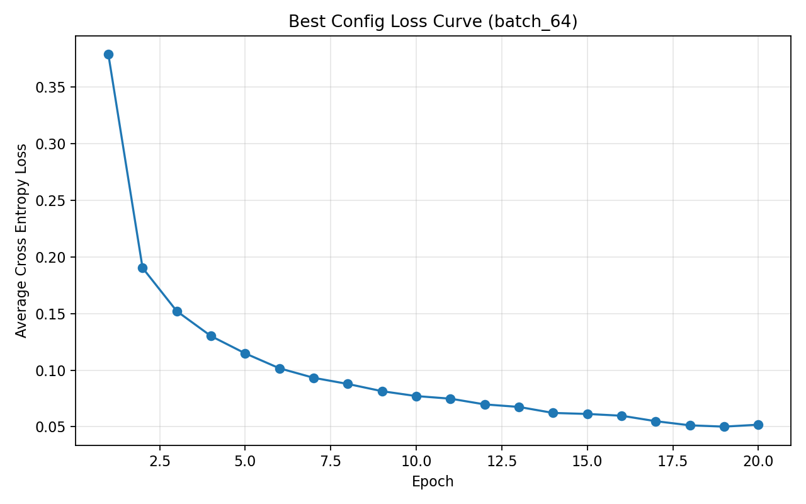

### 하이퍼파라미터 스윕 결과

아래 표는 기준 모델에서 하나씩 조건을 바꾸었을 때의 결과다. 이 표를 볼 때는 Test 정확도만 보기보다, 그 정확도를 얻기 위해 학습 시간이 얼마나 늘었는지, 파라미터 수가 얼마나 증가했는지를 함께 보는 것이 중요하다.

| 실험 | 변경점 | Test | 기준 대비 | Train | Loss(end) | 시간 | 파라미터 |
| --- | --- | ---: | ---: | ---: | ---: | ---: | ---: |
| `batch_64` | 미니배치 크기 감소 | 98.54% | +0.14%p | 99.80% | 0.0519 | 203.6s | 537,354 |
| `wide_1024_512` | 은닉층 너비 증가 | 98.54% | +0.14%p | 99.89% | 0.0267 | 331.1s | 1,336,842 |
| `tuned_dropout_0_4_epochs_30` | Dropout 감소 + 반복 증가 | 98.52% | +0.12%p | 99.97% | 0.0208 | 207.9s | 537,354 |
| `dropout_0_4` | Dropout 비율 감소 | 98.48% | +0.08%p | 99.92% | 0.0276 | 148.0s | 537,354 |
| `deep_512_512_256` | 은닉층 깊이 증가 | 98.43% | +0.03%p | 99.78% | 0.0493 | 205.2s | 801,034 |
| `baseline` | 기준 설정 | 98.40% | +0.00%p | 99.82% | 0.0442 | 121.8s | 537,354 |
| `epochs_30` | 반복 횟수 증가 | 98.40% | +0.00%p | 99.94% | 0.0307 | 167.6s | 537,354 |

### 정확도 비교 그래프

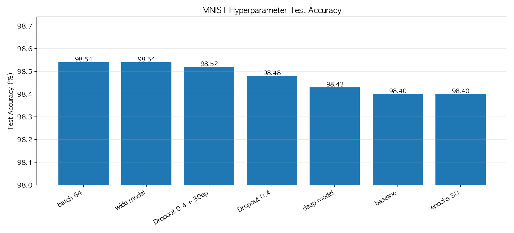

### 손실 곡선 비교

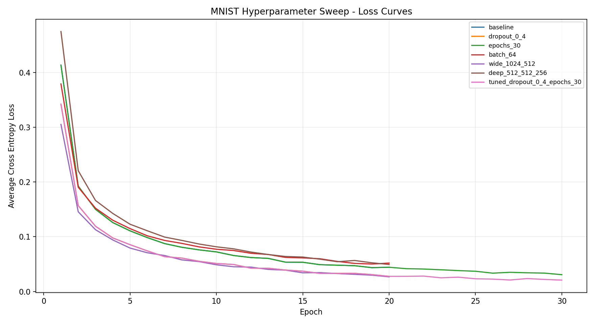

### 모델 크기와 정확도

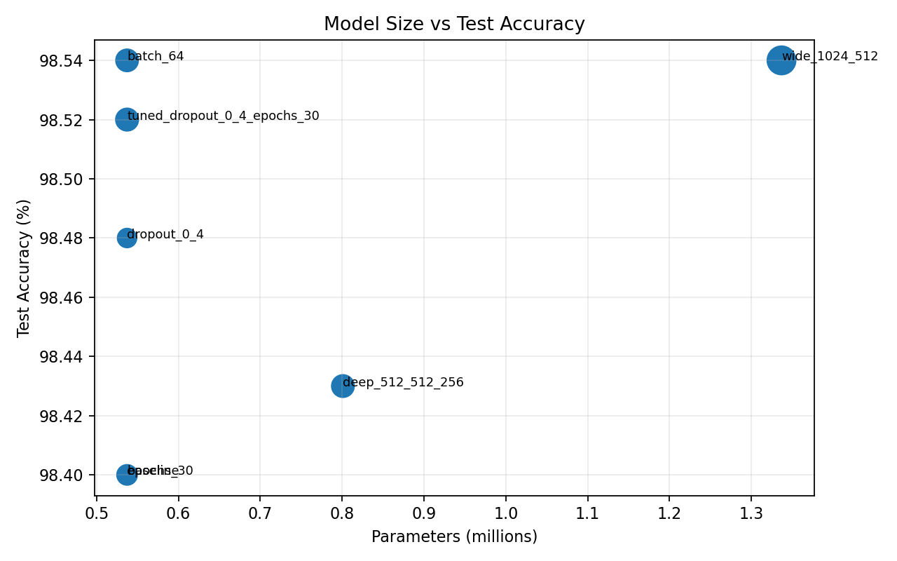

### Optimizer 비교: Adam vs SGD

앞선 하이퍼파라미터 실험에서는 조건을 바꿔도 Test 정확도 차이가 생각보다 크지 않았다. 이 현상이 Adam optimizer의 안정적인 업데이트 때문인지 확인하기 위해, 같은 핵심 조건을 SGD(`lr=0.1`)로도 반복했다. Adam은 `lr=0.001`, SGD는 `lr=0.1`을 사용했다. 두 optimizer는 학습률 스케일이 다르기 때문에 같은 lr 값을 맞추기보다, 각 optimizer에서 비교적 안정적으로 쓰기 쉬운 값을 선택했다.

| 조건 | Adam Test | SGD Test | 차이(Adam-SGD) | Adam Loss | SGD Loss |
| --- | ---: | ---: | ---: | ---: | ---: |
| `baseline` | 98.40% | 98.00% | +0.40%p | 0.0442 | 0.1027 |
| `dropout_0_4` | 98.48% | 98.29% | +0.19%p | 0.0276 | 0.0715 |
| `epochs_30` | 98.40% | 98.22% | +0.18%p | 0.0307 | 0.0734 |
| `batch_64` | 98.54% | 98.35% | +0.19%p | 0.0519 | 0.0827 |
| `wide_1024_512` | 98.54% | 98.03% | +0.51%p | 0.0267 | 0.0760 |

결과를 보면 Adam 5개 실험의 Test 정확도 범위는 98.40~98.54%로 0.14%p에 그쳤다. 반면 SGD는 98.00~98.35%로 0.35%p 범위에서 움직였다. 평균 Test 정확도도 Adam은 98.47%, SGD는 98.18%로 Adam이 약 0.29%p 높았다. 즉 Adam은 최종 정확도도 조금 높았고, 조건을 바꾸어도 결과가 더 좁은 범위에 모였다.

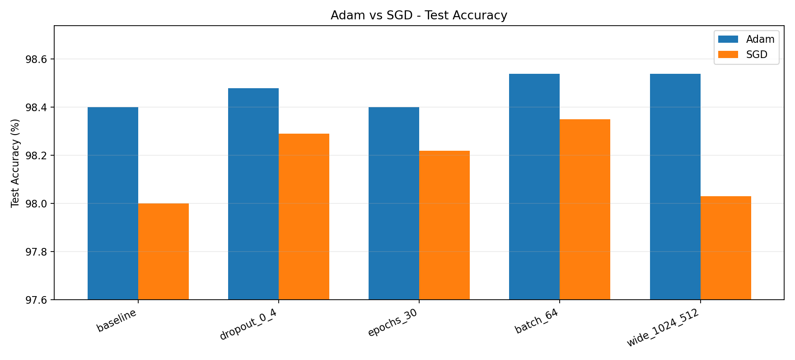

손실 곡선에서도 같은 흐름이 보인다. Adam은 초반부터 빠르게 loss를 낮추고, SGD도 충분히 학습되지만 같은 epoch 수에서는 Adam보다 loss가 높게 남았다. 이 때문에 Adam 기반 실험에서는 하이퍼파라미터를 조금 바꾸어도 결과 차이가 크게 벌어지지 않았다고 볼 수 있다.

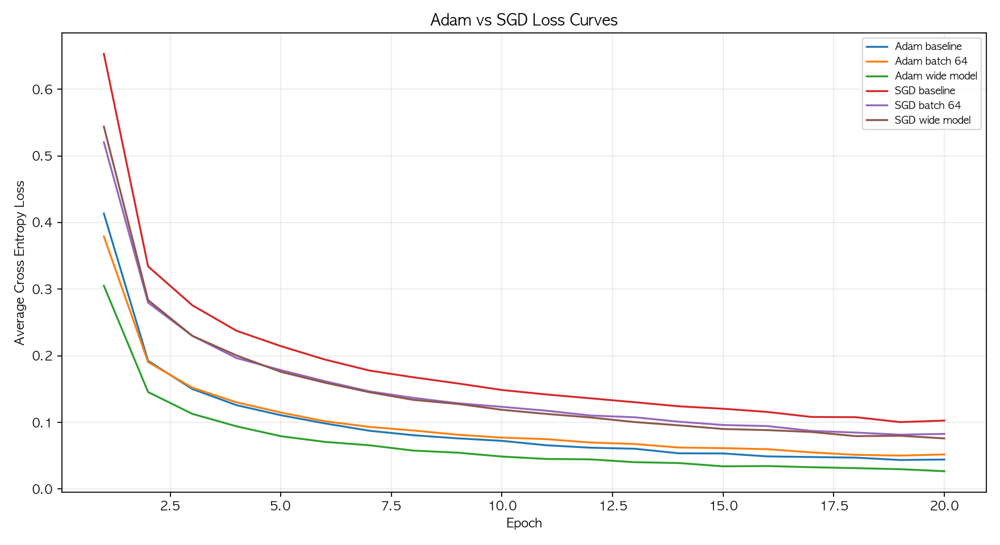

### 상관관계 진단 실험

전체 60,000개 학습 데이터를 사용하는 최종 성능 실험은 이미 98%대에 도달했기 때문에 조건별 정확도 차이가 작았다. 발표에서 상관관계를 설명하려면 “좋은 설정들끼리의 미세한 차이”만으로는 부족했다. 그래서 별도의 진단 실험을 추가했다. 이 실험은 최종 제출 점수를 높이기 위한 실험이 아니라, 과적합·학습률·반복 횟수의 영향을 눈에 보이게 만들기 위한 실험이다.

진단 실험은 두 종류로 나누었다.

- **과적합 실험**: train 500개만 사용하고, 은닉층 `[1024, 512]`의 큰 모델을 120 epoch 학습했다.
- **학습률 안정성 실험**: train 5,000개만 사용하고 Adam `lr=0.001`, SGD `lr=0.1`, SGD `lr=1.0`을 30 epoch 비교했다.

#### 기존 전체 데이터 실험의 기준 대비 효과 요약

처음에는 산점도로 상관관계를 표현했지만, 정확도 범위가 98.40~98.54%로 너무 좁아 점의 위치보다 실험 이름만 눈에 띄었다. 그래서 발표에서는 기준 실험 대비 Test 정확도가 얼마나 올랐는지, 그 대가로 학습 시간과 파라미터 수가 얼마나 늘었는지를 나란히 비교하는 방식이 더 적합하다고 판단했다.

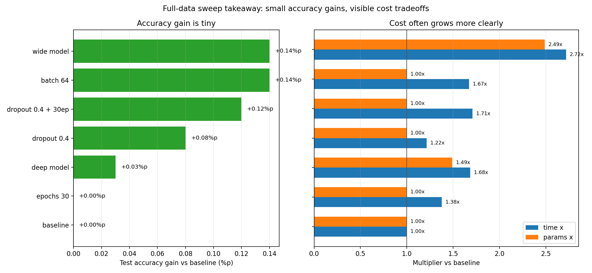

왼쪽 그래프는 기준 대비 정확도 증가량이고, 오른쪽 그래프는 기준 대비 학습 시간과 파라미터 수의 배율이다. 가장 큰 정확도 증가는 `batch_64`와 `wide_1024_512`의 +0.14%p였다. 하지만 `batch_64`는 학습 시간이 1.67배로 늘었고, `wide_1024_512`는 학습 시간이 2.72배, 파라미터 수가 2.49배로 늘었다. 반대로 `epochs_30`은 반복 횟수와 업데이트 수가 증가했지만 Test 정확도는 기준과 같았다. 이 결과는 전체 데이터 기준에서는 이미 성능이 어느 정도 포화되어, 정확도 차이보다 비용 차이가 더 분명하게 드러난다는 점을 보여준다.

#### 손실은 항상 균일하게 감소하는가

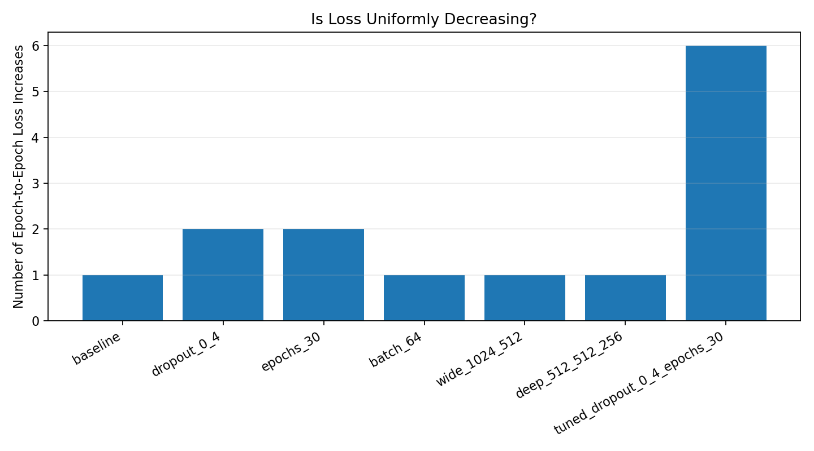

손실은 전체적으로 감소하지만, 모든 epoch에서 항상 균일하게 감소하지는 않았다. 미니배치 순서가 매 epoch 섞이고 Dropout이 무작위로 적용되기 때문에 epoch 평균 loss에도 작은 흔들림이 생긴다. 특히 `dropout_0_4 + epochs_30` 조합은 후반부에 loss 증가가 6번 발생했다. 따라서 학습 곡선은 “큰 추세로 감소하는지”를 봐야 하고, 한두 epoch의 작은 반등만으로 실패라고 판단하면 안 된다.

#### 과적합을 의도적으로 만든 결과

| 실험 | 조건 | Train | Test | Gap | Train loss | Test loss |
| --- | --- | ---: | ---: | ---: | ---: | ---: |
| `tiny_wide_no_reg` | train 500개, 큰 모델, 정규화 없음 | 100.00% | 83.44% | 16.56%p | 0.0000 | 0.8585 |
| `tiny_wide_regularized` | train 500개, 큰 모델, BatchNorm+Dropout | 100.00% | 83.52% | 16.48%p | 0.0001 | 0.6529 |

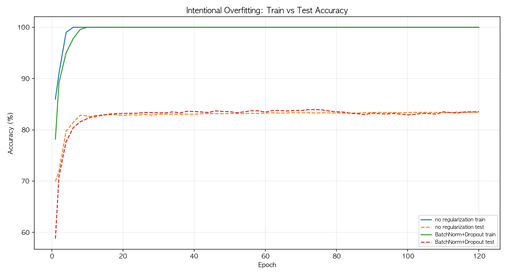

train 데이터가 500개로 작고 모델은 큰 경우, 모델은 몇 epoch 만에 train 정확도 100%에 도달했다. 하지만 test 정확도는 83%대에서 거의 멈췄고, train-test gap은 약 16%p 이상으로 벌어졌다. 발표에서는 이 그래프를 통해 “학습 데이터를 잘 맞히는 것”과 “처음 보는 데이터를 잘 맞히는 것”이 다를 수 있음을 보여줄 수 있다.

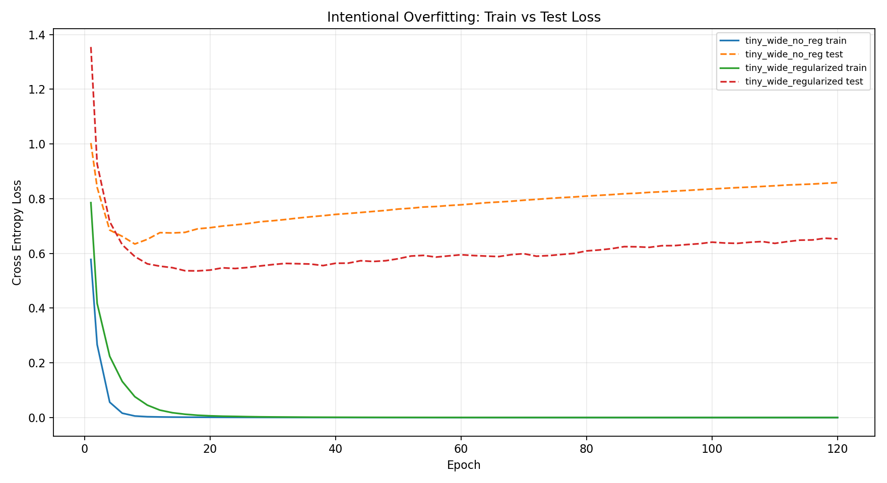

loss 기준으로 보면 과적합이 더 분명하다. train loss는 거의 0까지 내려가지만 test loss는 초반에 내려간 뒤 다시 상승한다. 즉 모델이 train 500개를 외우는 방향으로 계속 최적화되면서, test 데이터에 대한 일반화 성능은 더 좋아지지 않는다. 이 실험은 epoch를 무작정 늘리면 train loss는 좋아져도 test loss가 나빠질 수 있음을 보여준다.

#### 학습률과 optimizer 안정성

| 실험 | Train | Test | Gap | Test loss | 해석 |
| --- | ---: | ---: | ---: | ---: | --- |
| `adam_lr_0_001` | 99.94% | 93.16% | 6.78%p | 0.2401 | 안정적으로 감소 |
| `sgd_lr_0_1` | 98.38% | 91.56% | 6.82%p | 0.2735 | 느리지만 안정적 |
| `sgd_lr_1_0` | 99.90% | 93.62% | 6.28%p | 0.2370 | 최종값은 좋지만 중간 진동이 큼 |

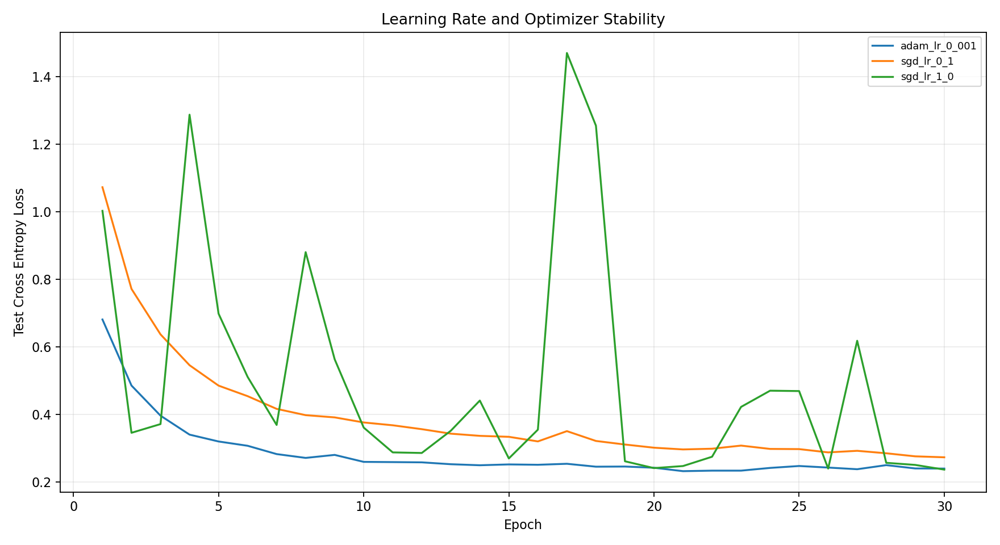

SGD `lr=1.0`은 최종 Test 정확도만 보면 좋아 보이지만, 중간에 test loss가 크게 튀는 구간이 여러 번 발생했다. 반면 Adam `lr=0.001`은 더 부드럽게 감소했다. 따라서 “최종 정확도”만 보면 두 설정의 차이가 작아 보일 수 있지만, 곡선을 함께 보면 학습 안정성의 차이가 드러난다. 발표에서는 이 부분을 통해 최종 점수 하나만으로 모델을 판단하면 놓치는 정보가 있다는 점을 강조할 수 있다.

---

## 6. 회고

### 왜 하이퍼파라미터별 정확도 차이가 작았나

이번 Adam 실험에서 조건별 Test 정확도 차이가 크지 않았던 이유는 세 가지로 정리할 수 있다.

- MNIST는 비교적 단순한 데이터셋이고, 현재 MLP 구조가 이미 98%대 정확도까지 도달해 성능 상한에 가까워졌다.
- 테스트 데이터가 10,000개이므로 0.10%p 차이는 약 10개 이미지 차이다. 따라서 98.40%와 98.54%의 차이는 실제로는 약 14개 샘플 차이에 해당한다.
- Adam, BatchNorm, Dropout 조합이 학습을 안정화해 batch size, Dropout, epoch 변화에 대한 민감도를 줄였다.

Optimizer 비교를 추가로 수행하자 이 해석이 더 분명해졌다. Adam은 조건을 바꾸어도 정확도가 좁은 범위에 모였지만, SGD는 전체 정확도가 낮고 조건별 변동폭도 더 컸다. 따라서 앞선 결과의 작은 차이는 실험이 잘못된 것이 아니라, Adam 기반 모델이 이미 안정적으로 수렴했고 MNIST에서 추가 정확도 개선 여지가 크지 않았기 때문으로 해석할 수 있다.

### 상관관계를 극적으로 보이게 하려면 왜 진단 실험이 필요한가

최종 제출용 실험은 좋은 성능을 내는 조건을 찾는 것이 목적이다. 반면 상관관계를 이해하려면 일부러 실패하거나 흔들리는 조건도 필요하다. 전체 train 60,000개를 쓰고 Adam, BatchNorm, Dropout을 함께 사용하면 대부분의 설정이 잘 수렴하기 때문에 그래프 차이가 작게 보인다.

진단 실험에서 train 데이터를 500개로 줄이고 큰 모델을 오래 학습시키자, train 정확도는 100%인데 test 정확도는 83%대에 머무는 과적합이 뚜렷하게 나타났다. 또한 SGD 학습률을 1.0으로 키우자 최종 정확도는 나쁘지 않아도 test loss가 크게 흔들렸다. 따라서 상관관계는 “좋은 최종 설정끼리 비교”할 때보다 “데이터 부족, 정규화 부족, 과도한 학습률”처럼 일부러 조건을 흔들 때 훨씬 잘 보인다.

### 하이퍼파라미터별 상관관계

**Batch size 감소**

예상은 명확했다. `batch_size=128`에서 `64`로 줄이면 1 epoch에서 60,000개 전체 데이터를 보는 것은 동일하지만, 업데이트 횟수는 469회에서 938회로 늘어난다. 더 자주 파라미터를 조정하므로 일반화가 조금 좋아질 수 있지만, 시간은 늘어날 것으로 예상했다.

실제 결과도 이 예상과 비슷했다. 총 업데이트 수는 9,380회에서 18,760회로 증가했고, Test 정확도는 98.40%에서 98.54%로 올랐다. 대신 학습 시간도 121.8초에서 203.6초로 증가했다. 따라서 작은 batch는 정확도를 소폭 끌어올렸지만, 그만큼 계산 비용을 더 요구했다.

**Epoch 증가**

`epochs=20`에서 `30`으로 늘리는 실험은 “더 오래 학습하면 Test 정확도도 계속 오를까?”를 확인하기 위한 실험이었다. 예상으로는 Train loss와 Train 정확도는 좋아지겠지만, 이미 충분히 수렴했다면 Test 정확도는 크게 변하지 않을 수 있다고 보았다.

실제로 총 업데이트 수는 9,380회에서 14,070회로 증가했고, Train 정확도는 99.82%에서 99.94%로 올랐으며 loss도 0.0442에서 0.0307로 낮아졌다. 그러나 Test 정확도는 98.40%로 그대로였다. 이 결과는 추가 반복이 학습 데이터에는 더 잘 맞추게 만들었지만, 테스트 성능 개선으로는 이어지지 않았다는 뜻이다.

**Dropout 비율 감소**

Dropout을 0.5에서 0.4로 낮추면 학습 중 꺼지는 뉴런이 줄어 모델이 더 쉽게 학습한다. 그래서 Train 성능은 좋아지고, Test 정확도도 소폭 오를 수 있다고 예상했다. 다만 정규화가 약해지는 만큼 과적합 가능성도 함께 커질 수 있다고 보았다.

실제로 loss는 0.0442에서 0.0276으로 낮아졌고 Train 정확도는 99.92%까지 올랐다. Test 정확도도 98.48%로 소폭 상승했다. 다만 `dropout=0.4`와 `epochs=30`을 함께 적용하면 Train 정확도는 99.97%까지 올랐지만 Test 정확도는 98.52%에 머물렀다. 이 결과는 더 낮은 train loss가 항상 더 높은 Test 정확도를 의미하지는 않는다는 점을 보여준다.

**은닉층 너비 증가**

은닉층을 `[512, 256]`에서 `[1024, 512]`로 넓힌 실험은 모델 표현력이 커지면 정확도도 함께 오르는지 보기 위한 실험이었다. 예상으로는 정확도가 조금 오를 수 있지만, 파라미터 수와 학습 시간이 더 크게 늘어날 가능성이 높다고 보았다.

실제로 Test 정확도는 98.54%로 최고 정확도와 같았다. 하지만 파라미터 수가 537,354개에서 1,336,842개로 약 2.49배 증가했고, 학습 시간도 331.1초로 가장 길었다. 정확도는 좋아졌지만 비용 대비 효율은 `batch_64`보다 낮았다.

**은닉층 깊이 증가**

은닉층을 `[512, 512, 256]`처럼 더 깊게 만든 실험은 깊이가 성능 향상으로 이어지는지 보기 위한 실험이었다. 다만 MNIST는 비교적 단순한 데이터셋이므로, 깊이를 늘리는 것만으로 큰 이득이 없을 수 있다고 예상했다.

실제로 파라미터 수는 801,034개로 늘었지만 Test 정확도는 98.43%에 그쳤다. 단순히 층을 깊게 만드는 것만으로는 이번 MLP 구조에서 성능이 크게 좋아지지 않았고, 오히려 최적화 난이도와 계산 비용이 증가했다.

### 최종 판단

가장 높은 Test 정확도는 `batch_64`와 `wide_1024_512`가 같은 98.54%였다. 하지만 `batch_64`는 기준 모델과 같은 파라미터 수를 유지했고, 넓은 모델보다 학습 시간이 약 127.5초 짧았다. 따라서 이번 제출용 최종 설정은 `batch_size=64`, `epochs=20`, `Dropout=0.5`, 은닉층 `[512, 256]`이 가장 균형이 좋다고 판단했다.

이번 실험에서 확인한 핵심은 다음과 같다.

- batch size가 달라져도 1 epoch에서 60,000개 전체 데이터를 모두 보는 것은 같다.
- batch size가 작아지면 업데이트 횟수가 늘어 정확도가 조금 좋아질 수 있지만 시간이 늘어난다.
- epoch를 늘리면 train loss와 train accuracy는 좋아지지만, 이미 수렴한 뒤에는 test accuracy가 거의 개선되지 않는다.
- 모델을 넓히면 정확도는 오를 수 있지만 파라미터 수와 시간이 크게 증가한다.
- 모델을 깊게 만드는 것은 이번 MLP 구조에서는 비용 대비 효과가 작았다.
