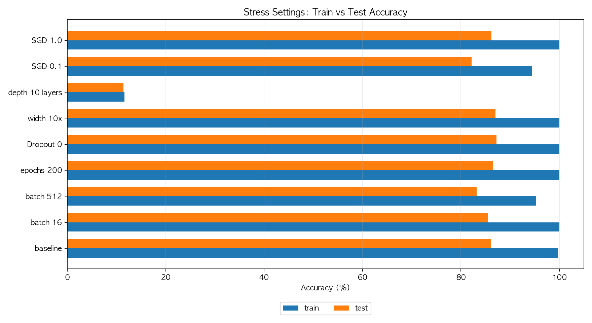
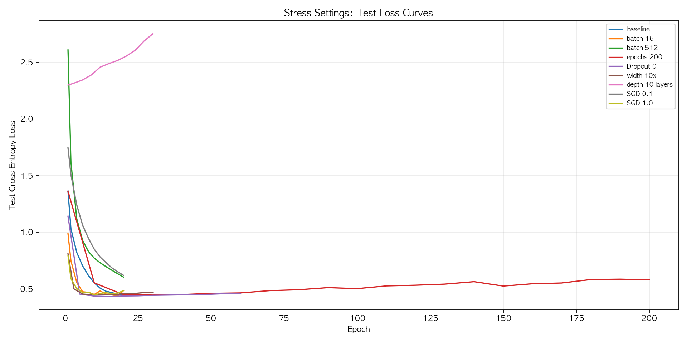

# MNIST 손글씨 인식 과제 보고서

## 0. 반·팀원

| 항목 | 내용 |
| --- | --- |
| **반** | 303 |
| **조** | 6조 |
| **팀원** | 최우녕, 이창원, 이혜연 |

---

## 1. 실험 목적

딥러닝 프레임워크 없이 NumPy만으로 MNIST 10-class 분류 신경망을 구현하고, 순전파·역전파·파라미터 업데이트까지 실제 딥러닝 과정을 구현하고 실행하는 것을 목표로 합니다.

batch_size, epoch, Dropout, optimizer, 은닉층 구조 같은 하이퍼파라미터가 학습 과정의 어떤 부분을 바꾸고, 그 변화가 정확도·loss·학습 시간·파라미터 수에 어떻게 연결되는지 관찰하기 위해 먼저 기준 모델을 정한 뒤 조건을 바꾸어 비교했습니다. 또한 차이가 작게 보이는 구간은 과적합이나 불안정한 학습률 조건을 의도적으로 만들어 상관관계를 살펴보았습니다.

---

## 2. 모델 구조

먼저 기준이 되는 모델 구조를 하나 정해 기준점으로 삼았고, 일부 조건만 바꾸며 결과가 어떻게 달라지는지 비교했습니다.

| 구분 | 내용 |
| --- | --- |
| **입력** | 784차원 벡터 (28x28 픽셀을 펼친 값, 0~1 정규화) |
| **은닉층 1** | Affine(784 -> 512) -> BatchNorm -> ReLU -> Dropout |
| **은닉층 2** | Affine(512 -> 256) -> BatchNorm -> ReLU -> Dropout |
| **출력층** | Affine(256 -> 10) -> Softmax |
| **손실 계산** | Softmax 결과와 정답을 비교해 Cross Entropy loss 계산 |
| **기준 모델 총 파라미터 수** | 537,354개 |

전체 흐름을 간단히 쓰면 다음과 같습니다.

```text
입력 784
-> Affine(512) -> BatchNorm -> ReLU -> Dropout
-> Affine(256) -> BatchNorm -> ReLU -> Dropout
-> Affine(10) -> Softmax
-> Cross Entropy Loss
```

은닉층 구조의 영향을 보기 위해 전체 데이터 실험에서는 은닉층 크기를 키운 `[1024, 512]`와 층을 하나 더 늘린 `[512, 512, 256]` 구조를 비교했고, 상관관계를 더 크게 보기 위한 극단 조건 실험에서는 `[5120]` 구조와 10층 구조도 추가로 실험했습니다.

---

## 3. 학습 설정

### 최종 제출 설정

| 항목 | 값 |
| --- | --- |
| 모델 구조 | 784 -> 512 -> 256 -> 10 |
| Optimizer | Adam |
| Learning rate | 0.001 |
| Epochs | 20 |
| Batch size | 64 |
| 학습 데이터 | MNIST train 60,000개 전체 |
| 테스트 데이터 | MNIST test 10,000개 전체 |
| Dropout ratio | 0.5 |
| BatchNorm momentum | 0.9 |
| 가중치 초기화 | He initialization |
| Seed | 42 |

1 epoch 당 60,000개 학습 데이터를 모두 학습했고, batch_size=64를 사용하여 20회 epoch 학습했습니다.

### 실험 설계 의도

전체 학습 데이터 60,000개를 사용해 제출용 성능을 측정했을 때 이미 98% 정답률을 보여주고 있었고, 그래서 상관관계를 보기 위해 하이퍼파라미터를 조절하여 결과를 관찰했습니다.

| 변경한 조건 | 실험 의도 | 예상한 변화 |
| --- | --- | --- |
| batch size 128 -> 16 | 더 작은 묶음으로 자주 업데이트하면 어떤 변화가 생기는지 확인했습니다. | 업데이트가 많아져 학습 데이터는 빨리 외울 수 있지만, 테스트 성능은 흔들릴 수 있다고 예상했습니다. |
| batch size 128 -> 512 | 큰 묶음으로 적게 업데이트하면 수렴이 느려지는지 확인했습니다. | 시간은 줄어들 수 있지만, 업데이트가 적어 정확도가 낮아질 수 있다고 예상했습니다. |
| epochs 20 -> 200 | 오래 반복하면 계속 좋아지는지, 아니면 과적합이 생기는지 확인했습니다. | 학습 정확도는 올라가지만, 테스트 손실은 다시 나빠질 수 있다고 예상했습니다. |
| Dropout 0.5 -> 0 | 정규화를 제거하면 모델이 얼마나 쉽게 외우는지 확인했습니다. | 학습 데이터는 쉽게 맞히지만, 테스트 성능 향상은 제한적일 것으로 예상했습니다. |
| 은닉층 `[512, 256]` -> `[5120]` | 모델 폭을 크게 키웠을 때 비용 대비 효과를 확인했습니다. | 파라미터 수와 시간이 크게 늘고, 정확도 이득은 제한적일 것으로 예상했습니다. |
| 은닉층 2개 -> 10개 | 층을 매우 깊게 쌓았을 때 학습이 잘 되는지 확인했습니다. | 깊이가 늘면 오히려 최적화가 어려워질 수 있다고 예상했습니다. |
| Adam -> SGD | 업데이트 방식에 따라 결과가 얼마나 달라지는지 확인했습니다. | Adam은 안정적이고, SGD는 학습률에 더 민감할 것으로 예상했습니다. |
| 큰 learning rate | 학습률이 너무 크면 손실 곡선이 흔들리는지 확인했습니다. | 최종 정확도와 별개로 중간 손실이 튈 수 있다고 예상했습니다. |

---

## 4. 실험 환경

| 항목 | 값 |
| --- | --- |
| 실행 환경 | Local Conda 환경 (`mnist-nn`) |
| CPU | Apple M4 |
| OS | macOS 26.3.1 arm64 |
| Python | 3.11.15 |
| NumPy | 2.4.6 |
| Matplotlib | 3.10.9 |
| 단일 기준 실험 | `scripts/run_report_experiment.py` |
| 전체 데이터 비교 실험 | `scripts/run_hparam_sweep.py` |
| Optimizer 비교 실험 | `scripts/run_optimizer_sweep.py` |
| 진단용 극단 조건 실험 | `scripts/run_diagnostic_experiments.py` |

---

## 5. 결과

### 최종 제출 모델

최종 설정은 학습 데이터 60,000개를 사용한 실험 중 batch size를 64로 설정한 `batch_64`가 98.54%로 가장 높아 선택하게 되었고, 신경망 크기를 `[1024, 512]`로 수정한 `wide_1024_512`도 동일하게 98.54%가 나왔지만 같은 정확도에 파라미터 수와 학습 시간이 더 필요했기 때문에 최종 설정으로 사용하지 않았습니다.

| 항목 | 값 |
| --- | --- |
| **선택 실험** | `batch_64` |
| **학습 정확도** | 99.80% |
| **테스트 정확도** | 98.54% |
| **총 파라미터 수** | 537,354개 |
| **학습 시간** | 203.57초 |
| **총 업데이트 수** | 18,760회 |
| **1 epoch 평균 손실** | 0.3790 |
| **20 epoch 평균 손실** | 0.0519 |


### 전체 데이터 기준 비교 결과

아래 표와 같이 하이퍼파라미터를 다양하게 바꿔본 결과에 대한 학습 정확도 차이에는 유의미한 변화가 없었습니다.

| 실험 | 변경점 | 테스트 정확도 | 기준 대비 | 학습 정확도 | 마지막 손실 | 시간 | 파라미터 |
| --- | --- | ---: | ---: | ---: | ---: | ---: | ---: |
| `batch_64` | batch size 감소 | 98.54% | +0.14%p | 99.80% | 0.0519 | 203.6s | 537,354 |
| `wide_1024_512` | 은닉층 폭 증가 | 98.54% | +0.14%p | 99.89% | 0.0267 | 331.1s | 1,336,842 |
| `tuned_dropout_0_4_epochs_30` | Dropout 감소 + epochs 증가 | 98.52% | +0.12%p | 99.97% | 0.0208 | 207.9s | 537,354 |
| `dropout_0_4` | Dropout 비율 감소 | 98.48% | +0.08%p | 99.92% | 0.0276 | 148.0s | 537,354 |
| `deep_512_512_256` | 은닉층 깊이 증가 | 98.43% | +0.03%p | 99.78% | 0.0493 | 205.2s | 801,034 |
| `baseline` | 기준 설정 | 98.40% | +0.00%p | 99.82% | 0.0442 | 121.8s | 537,354 |
| `epochs_30` | epochs 증가 | 98.40% | +0.00%p | 99.94% | 0.0307 | 167.6s | 537,354 |


### Adam과 SGD 비교

첫 실험에서 하이퍼파라미터 조건을 바꿔도 차이가 크지 않았기 때문에 optimizer 모델을 바꿔보는 것으로 실험 방향을 바꿨고, Adam은 `lr=0.001`, SGD는 `lr=0.1`을 사용하여 실험했습니다.

| 조건 | Adam Test | SGD Test | 차이(Adam-SGD) | Adam Loss | SGD Loss |
| --- | ---: | ---: | ---: | ---: | ---: |
| `baseline` | 98.40% | 98.00% | +0.40%p | 0.0442 | 0.1027 |
| `dropout_0_4` | 98.48% | 98.29% | +0.19%p | 0.0276 | 0.0715 |
| `epochs_30` | 98.40% | 98.22% | +0.18%p | 0.0307 | 0.0734 |
| `batch_64` | 98.54% | 98.35% | +0.19%p | 0.0519 | 0.0827 |
| `wide_1024_512` | 98.54% | 98.03% | +0.51%p | 0.0267 | 0.0760 |

결과를 보면 SGD가 Adam보다 정확도가 소폭 차이나긴 했고, 비교적 Adam이 변화 폭이 작다는 것을 알 수 있었습니다.


### 새로 추가한 극단 조건 실험

기존 실험에서 큰 변화를 발견하지 못해 상관관계를 더 잘 보기 위해 별도의 실험을 추가했습니다.

전체 데이터를 사용하면 대부분 잘 학습되어 차이가 작게 보였기 때문에, 학습 데이터는 1,000개로 줄이고 테스트 데이터는 5,000개만 사용한 뒤 조건을 더 크게 바꾸어 극단적인 상황으로 실험을 이어서 해봤습니다.

| 실험 | 의도 | 학습 정확도 | 테스트 정확도 | 차이 | 테스트 손실 | 업데이트 | 파라미터 | 시간 |
| --- | --- | ---: | ---: | ---: | ---: | ---: | ---: | ---: |
| `stress_baseline` | 진단 기준 | 99.70% | 86.10% | 13.60%p | 0.4489 | 160 | 537,354 | 3.6s |
| `stress_batch_16` | batch size를 16으로 축소 | 100.00% | 85.52% | 14.48%p | 0.4846 | 1,260 | 537,354 | 13.9s |
| `stress_batch_512` | batch size를 512로 확대 | 95.30% | 83.22% | 12.08%p | 0.6039 | 40 | 537,354 | 3.7s |
| `stress_epochs_200` | 200 epochs까지 과하게 반복 | 100.00% | 86.48% | 13.52%p | 0.5801 | 1,600 | 537,354 | 33.3s |
| `stress_dropout_0` | Dropout 제거 | 100.00% | 87.20% | 12.80%p | 0.4609 | 480 | 537,354 | 8.8s |
| `stress_width_10x` | 은닉층 폭 약 10배 확대 | 100.00% | 87.00% | 13.00%p | 0.4708 | 240 | 4,080,650 | 46.7s |
| `stress_depth_10_layers` | 은닉층 10개 | 11.60% | 11.42% | 0.18%p | 2.7508 | 240 | 800,778 | 12.6s |
| `stress_sgd_lr_0_1` | SGD 비교 | 94.40% | 82.16% | 12.24%p | 0.6197 | 160 | 537,354 | 6.0s |
| `stress_sgd_lr_1_0` | 큰 learning rate SGD | 100.00% | 86.18% | 13.82%p | 0.4850 | 160 | 537,354 | 3.7s |



대부분의 설정은 학습 정확도가 100%까지 올라갔지만, 테스트 정확도는 85~87%대에 머물렀습니다. 이를 통해 작은 데이터에서는 학습 데이터를 외우는 것과 처음 보는 데이터를 잘 맞히는 것이 다르다는 것을 알게 되었습니다.

특히 `stress_depth_10_layers`는 파라미터 수가 기준보다 많았는데도 테스트 정확도가 11.42%에 그쳤습니다. MNIST는 10개 숫자 중 하나를 맞히는 문제라서 무작위로 찍어도 약 10%가 나오는데, 이 결과는 거의 학습에 실패한 수준이었습니다. 층을 너무 많이 쌓으면 계산 과정이 길어지고 역전파도 복잡해져 오히려 학습이 불안정해질 수 있기 때문에, 단순히 층을 많이 쌓는다고 성능이 좋아지는 것은 아니라는 사실을 알게 되었습니다.



추가로 `stress_epochs_200`은 초반에는 테스트 loss가 내려갔지만, 후반에는 다시 올라갔고 `stress_depth_10_layers`는 loss가 계속 높게 남는 등 오래 하거나 층을 많이 쌓는 것이 항상 답은 아니라는 것을 알게 되었습니다.

### 과적합과 학습률 진단

과적합 진단을 위해 학습 데이터는 500개만 사용하고, 큰 모델을 오래 학습시켜 학습 데이터와 테스트 데이터의 차이가 얼마나 벌어지는지 보았습니다.

| 실험 | 조건 | 학습 정확도 | 테스트 정확도 | 차이 | 학습 손실 | 테스트 손실 |
| --- | --- | ---: | ---: | ---: | ---: | ---: |
| `tiny_wide_no_reg` | 학습 데이터 500개, 큰 모델, 정규화 없음 | 100.00% | 83.44% | 16.56%p | 0.0000 | 0.8585 |
| `tiny_wide_regularized` | 학습 데이터 500개, 큰 모델, BatchNorm+Dropout | 100.00% | 83.52% | 16.48%p | 0.0001 | 0.6529 |


결과는 예상처럼 학습 데이터에서는 거의 맞히는데 테스트 정확도는 83%대에서 멈췄고, 학습과 테스트의 차이는 약 16%p 이상으로 벌어졌으며, 학습 loss는 거의 0까지 내려가지만 테스트 loss는 초반에 내려간 뒤 다시 올라가는 것을 확인할 수 있었습니다.

| 실험 | 학습 정확도 | 테스트 정확도 | 차이 | 테스트 손실 | 해석 |
| --- | ---: | ---: | ---: | ---: | --- |
| `adam_lr_0_001` | 99.94% | 93.16% | 6.78%p | 0.2401 | 안정적으로 감소 |
| `sgd_lr_0_1` | 98.38% | 91.56% | 6.82%p | 0.2735 | 느리지만 안정적 |
| `sgd_lr_1_0` | 99.90% | 93.62% | 6.28%p | 0.2370 | 최종값은 좋지만 중간 진동이 큼 |


SGD `lr=1.0`은 최종 테스트 정확도만 보면 좋아 보이지만, 중간에 테스트 loss가 크게 튀는 구간이 여러 번 있었고 Adam `lr=0.001`은 더 부드럽게 감소했는데, 결과를 볼 때는 마지막 정확도 하나만 보는 것보다 loss 곡선을 같이 보는 편이 더 적절하다고 느끼게 되었습니다.

---

## 6. 회고

### 왜 처음 결과 차이가 작았나

처음 전체 데이터 실험에서는 테스트 정확도가 98.40~98.54% 사이에 모여 큰 차이가 보이지 않았는데, MNIST 데이터 자체가 비교적 단순하고 현재 모델이 이미 98%대까지 학습된 상태였으며 Adam, BatchNorm, Dropout 조합이 학습을 안정적으로 만들어 작은 설정 변화가 결과에 크게 드러나지 않았기 때문이라고 생각합니다.

테스트 데이터 10,000개 기준으로 0.10%p 차이는 약 10개 이미지 차이이기 때문에 98.40%와 98.54%의 차이도 실제로는 약 14개 정도의 차이였고, 그래서 전체 데이터만으로는 상관관계를 보기 어려워 학습 데이터 1,000개와 테스트 데이터 5,000개를 사용한 극단 조건 실험을 추가했습니다.

극단 조건 실험에서는 학습 정확도와 테스트 정확도의 차이, 테스트 loss가 다시 올라가는 흐름, 깊은 모델이 학습에 실패하는 모습이 더 잘 보였고, 단순히 최종 정확도만 보는 것보다 학습 과정 전체를 함께 봐야 한다는 점을 확인했습니다.

### 설정별로 본 결과

**Batch size 변화**

Batch size는 학습 데이터 전체 개수를 바꾸는 값이 아니라 한 번에 몇 개씩 묶어서 학습할지를 정하는 값이며, 극단 조건 실험에서 기준 `batch_size=128`은 테스트 정확도 86.10%였지만 `batch_size=16`은 업데이트 수가 160회에서 1,260회로 크게 늘었는데도 테스트 정확도는 85.52%로 낮아졌고, `batch_size=512`는 업데이트 수가 40회로 줄어 테스트 정확도도 83.22%까지 낮아졌기 때문에 batch size를 줄이거나 키우는 것만으로 성능이 좋아지는 것은 아니었습니다.

**Epochs 변화**

기준 실험은 20 epochs에서 테스트 정확도 86.10%였고, `stress_epochs_200`은 200 epochs까지 늘려 학습 정확도는 100%가 되었지만 테스트 정확도는 86.48%로 거의 비슷했으며 테스트 loss는 0.4489에서 0.5801로 더 커졌기 때문에 반복 횟수를 많이 늘리면 학습 데이터에는 더 잘 맞지만 테스트 성능이 좋아지기보다 과적합으로 이어질 수 있음을 확인했습니다.

**Dropout**

`stress_dropout_0`은 Dropout을 완전히 제거한 실험으로 학습 정확도는 100%까지 올라가고 테스트 정확도도 87.20%로 기준보다 조금 높았지만, 기준보다 오래 학습한 조건이기도 하고 테스트 loss는 0.4609로 남아 있었기 때문에 Dropout 제거가 학습 데이터를 더 쉽게 맞히게 할 수는 있어도 일반화 성능을 안정적으로 크게 올리는 방법이라고 보기는 어려웠습니다.

**모델 크기**

`stress_width_10x`는 은닉층 폭을 `[5120]`으로 크게 키운 실험으로 파라미터 수가 537,354개에서 4,080,650개로 크게 늘고 학습 시간도 46.7초까지 증가했지만, 학습 정확도는 100%인 반면 테스트 정확도는 87.00%에 머물렀기 때문에 모델을 크게 만들면 학습 데이터는 더 잘 맞힐 수 있어도 계산 비용 대비 테스트 정확도 이득은 제한적이었습니다.

**모델 깊이**

`stress_depth_10_layers`는 은닉층을 10개로 늘린 실험인데 학습 정확도 11.60%, 테스트 정확도 11.42%로 거의 무작위 추측 수준에 머물렀고 loss도 2.7508로 높게 남았기 때문에, 층을 깊게 쌓으면 표현할 수 있는 범위는 늘어날 수 있지만 계산 과정과 역전파가 복잡해져 이번 구조에서는 성능 향상보다 학습 실패가 더 크게 나타났습니다.

**업데이트 방식과 학습률**

optimizer를 Adam에서 SGD로 바꾼 실험에서는 `stress_sgd_lr_0_1`의 테스트 정확도가 82.16%로 기준보다 낮았고, `stress_sgd_lr_1_0`은 테스트 정확도 86.18%로 기준과 비슷했지만 큰 learning rate 조건에서는 loss 곡선이 중간에 흔들릴 수 있었기 때문에 optimizer와 learning rate를 볼 때는 마지막 정확도뿐 아니라 학습 과정에서 loss가 어떻게 변하는지도 같이 봐야 합니다.

### 최종 판단

최종 제출용 모델은 전체 데이터 60,000개를 사용한 실험 중 `batch_64`로 선택했는데, `wide_1024_512`와 같은 98.54% 테스트 정확도를 보였지만 파라미터 수는 기준 모델과 같고 학습 시간도 더 짧아 성능과 비용의 균형이 더 좋다고 판단했기 때문입니다.

이번 실험을 통해 batch size가 달라져도 1 epoch에서 사용하는 학습 데이터의 범위는 같지만 업데이트 횟수와 학습 시간이 달라지고, epochs를 200까지 늘리거나 Dropout을 제거하거나 모델 폭을 크게 키우거나 층을 10개로 늘리는 것이 항상 테스트 성능 향상으로 이어지는 것은 아니며, 특히 작은 데이터에서는 학습 데이터를 잘 맞히는 것과 처음 보는 데이터를 잘 맞히는 것이 다르다는 점을 확인했습니다.
