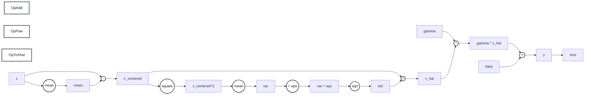
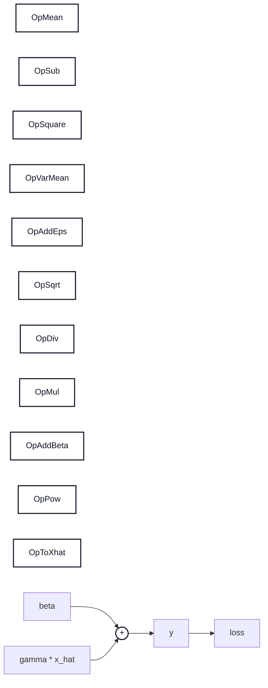
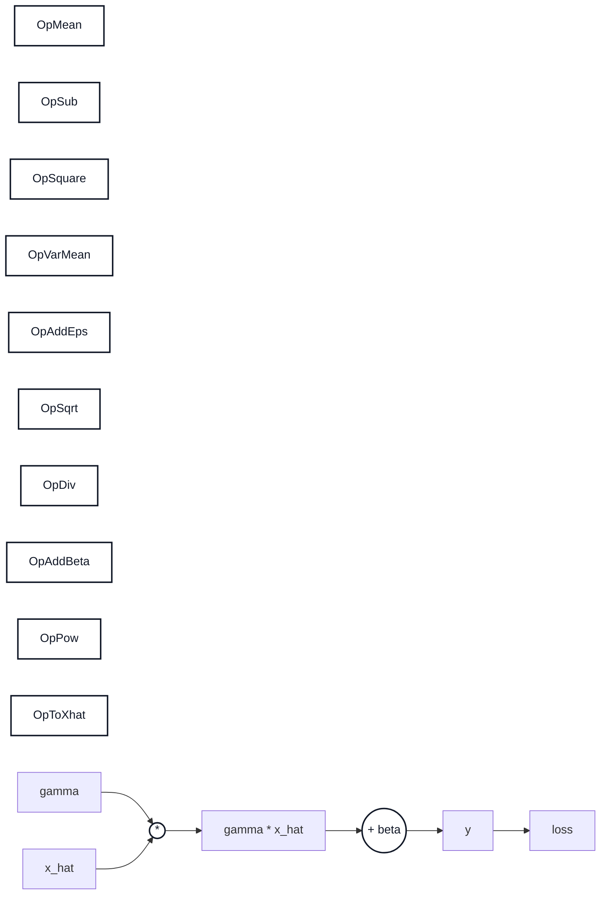
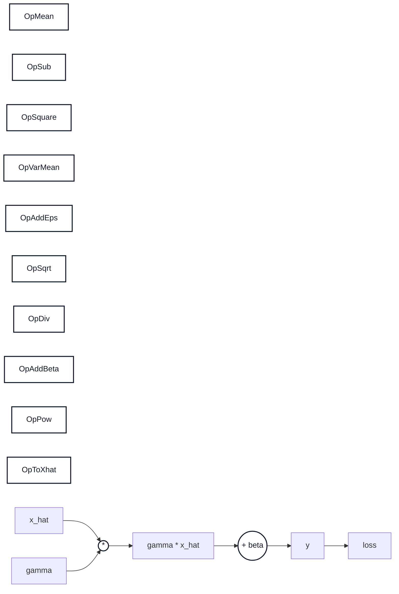
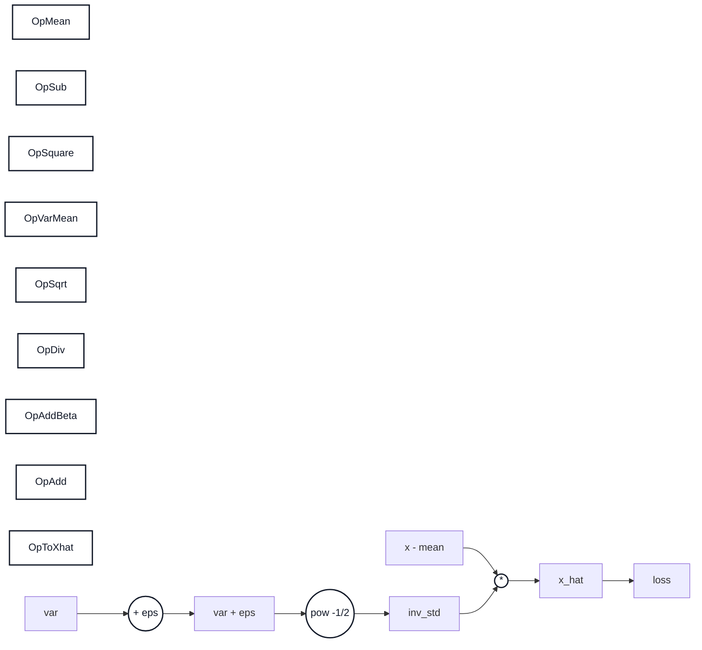
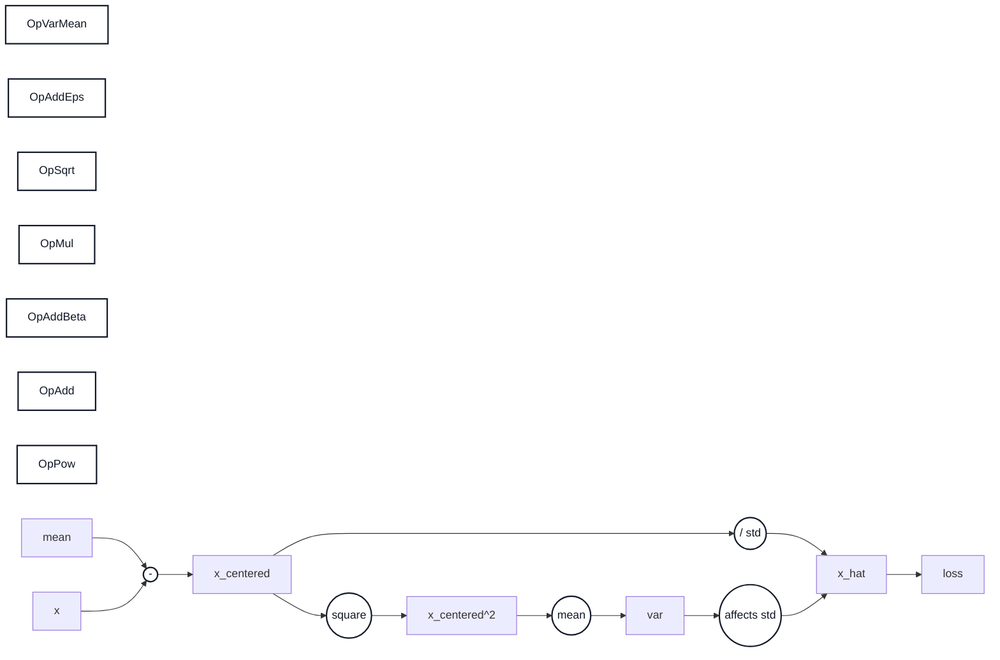
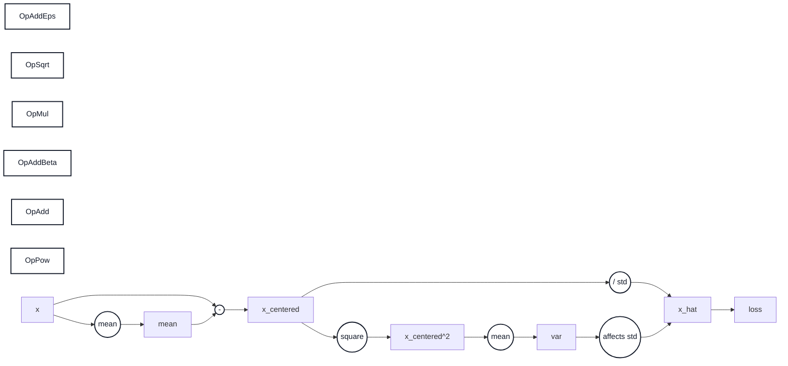

# BatchNorm 역전파 수식 정리

이 문서는 VS Code 기본 Markdown Preview에서 깨지지 않도록 LaTeX 대신 ASCII 수식으로 작성한다.

## 1. 최종 공식

BatchNorm forward:

```text
mean = mean(x, axis=0)
var = mean((x - mean)^2, axis=0)
x_hat = (x - mean) / sqrt(var + eps)
y = gamma * x_hat + beta
```

역전파에서 위에서 내려오는 gradient를 `dy`라고 하면:

```text
dbeta = sum(dy, axis=0)
dgamma = sum(x_hat * dy, axis=0)
dx_hat = gamma * dy
```

분산에 대한 기울기:

```text
dvar = sum(
    dx_hat * (x - mean) * (-0.5) * (var + eps)^(-3/2),
    axis=0
)
```

평균에 대한 기울기:

```text
dmean =
    sum(dx_hat * (-1 / sqrt(var + eps)), axis=0)
    + dvar * sum(-2 * (x - mean), axis=0) / batch_size
```

입력 `x`에 대한 최종 기울기:

```text
dx =
    dx_hat / sqrt(var + eps)
    + dvar * 2 * (x - mean) / batch_size
    + dmean / batch_size
```

NumPy 코드로 쓰면:

```python
dbeta = np.sum(dy, axis=0)
dgamma = np.sum(x_hat * dy, axis=0)

dx_hat = dy * gamma

dvar = np.sum(
    dx_hat * (x - mean) * -0.5 * (var + eps) ** (-1.5),
    axis=0,
)

dmean = (
    np.sum(dx_hat * -1 / np.sqrt(var + eps), axis=0)
    + dvar * np.sum(-2 * (x - mean), axis=0) / batch_size
)

dx = (
    dx_hat / np.sqrt(var + eps)
    + dvar * 2 * (x - mean) / batch_size
    + dmean / batch_size
)
```

## 2. 기호 의미

```text
x: BatchNorm 입력, shape = (batch_size, feature_dim)
mean: feature별 평균, shape = (feature_dim,)
var: feature별 분산, shape = (feature_dim,)
x_hat: 정규화된 입력, shape = (batch_size, feature_dim)
gamma: scale 파라미터, shape = (feature_dim,)
beta: shift 파라미터, shape = (feature_dim,)
dy: 다음 layer에서 넘어온 gradient, shape = (batch_size, feature_dim)
```

BatchNorm은 feature마다 평균과 분산을 계산한다.  
입력이 `(batch_size, feature_dim)`이면 feature는 열(column)이다.

예:

```text
x =
[
  [1, 10, 100],
  [2, 20, 200],
  [3, 30, 300],
]
```

feature별 평균:

```text
mean[0] = mean([1, 2, 3])
mean[1] = mean([10, 20, 30])
mean[2] = mean([100, 200, 300])
```

따라서 NumPy에서는 `axis=0`으로 계산한다.

## 3. forward 계산 그래프

BatchNorm forward를 작은 단계로 나누면 다음과 같다.

```text
x
-> mean = mean(x)
-> x_centered = x - mean
-> var = mean(x_centered^2)
-> std = sqrt(var + eps)
-> x_hat = x_centered / std
-> y = gamma * x_hat + beta
```

역전파는 이 흐름을 거꾸로 따라간다.

```text
dy
-> dbeta, dgamma
-> dx_hat
-> dvar
-> dmean
-> dx
```

전체 계산 그래프:



역전파는 오른쪽에서 왼쪽으로 진행한다.

```text
loss -> y -> x_hat -> (x_centered, var, mean) -> x
```

각 노드에서는 다음 원칙을 쓴다.

```text
나가는 gradient = 들어온 gradient * 국소 미분
```

여기서 국소 미분은 “현재 노드의 출력이 현재 노드의 입력에 대해 얼마나 변하는가”이다.

## 4. beta 기울기 유도

forward에서:

```text
y = gamma * x_hat + beta
```

`beta`는 각 feature에 더해지는 값이다.  
한 batch 안의 모든 샘플에 같은 `beta`가 더해진다.

예를 들어 feature가 3개이고 batch가 4개라면:

```text
y[0] = gamma * x_hat[0] + beta
y[1] = gamma * x_hat[1] + beta
y[2] = gamma * x_hat[2] + beta
y[3] = gamma * x_hat[3] + beta
```

`beta`는 모든 샘플에 영향을 주므로 gradient도 batch 방향으로 모두 더한다.

```text
dbeta = sum(dy, axis=0)
```

계산 그래프:



국소 미분:

```text
dy/dbeta = 1
```

체인룰:

```text
dbeta = sum(dL/dy * dy/dbeta, axis=0)
      = sum(dy * 1, axis=0)
      = sum(dy, axis=0)
```

## 5. gamma 기울기 유도

forward에서:

```text
y = gamma * x_hat + beta
```

`gamma`는 `x_hat`에 곱해지는 값이다.

따라서 `gamma`에 대한 영향은:

```text
dy * x_hat
```

이고, batch 전체에 대해 더하면:

```text
dgamma = sum(dy * x_hat, axis=0)
```

계산 그래프:



국소 미분:

```text
d(gamma * x_hat)/dgamma = x_hat
```

체인룰:

```text
dgamma = sum(dy * x_hat, axis=0)
```

## 6. x_hat 기울기 유도

forward에서:

```text
y = gamma * x_hat + beta
```

`x_hat` 입장에서 보면 `gamma`가 곱해져 있다.

그래서:

```text
dx_hat = dy * gamma
```

계산 그래프:



국소 미분:

```text
d(gamma * x_hat)/dx_hat = gamma
```

체인룰:

```text
dx_hat = dy * gamma
```

## 7. var 기울기 유도

정규화 식:

```text
x_hat = (x - mean) / sqrt(var + eps)
```

다르게 쓰면:

```text
x_hat = (x - mean) * (var + eps)^(-1/2)
```

`var`에 영향을 받는 부분은:

```text
(var + eps)^(-1/2)
```

이 부분을 `var`에 대해 미분하면:

```text
(-1/2) * (var + eps)^(-3/2)
```

그리고 앞에 `(x - mean)`이 곱해져 있으므로:

```text
dvar = sum(
    dx_hat * (x - mean) * (-1/2) * (var + eps)^(-3/2),
    axis=0
)
```

계산 그래프:



국소 미분:

```text
d(x_hat)/dvar
= (x - mean) * d((var + eps)^(-1/2))/dvar
= (x - mean) * (-1/2) * (var + eps)^(-3/2)
```

체인룰:

```text
dvar = sum(dx_hat * d(x_hat)/dvar, axis=0)
```

## 8. mean 기울기 유도

`mean`은 두 경로로 손실에 영향을 준다.

첫 번째 경로:

```text
mean -> x - mean -> x_hat -> loss
```

두 번째 경로:

```text
mean -> x - mean -> var -> x_hat -> loss
```

그래서 `dmean`은 두 항의 합이다.

첫 번째 경로에서:

```text
x_hat = (x - mean) / sqrt(var + eps)
```

`mean`이 커지면 `x - mean`은 작아진다.

```text
d(x - mean) / dmean = -1
```

따라서 첫 번째 항:

```text
sum(dx_hat * (-1 / sqrt(var + eps)), axis=0)
```

두 번째 경로는 `var`를 통해 들어온다.

분산:

```text
var = mean((x - mean)^2)
```

`mean`에 대해 보면:

```text
dvar/dmean = sum(-2 * (x - mean)) / batch_size
```

따라서 두 번째 항:

```text
dvar * sum(-2 * (x - mean), axis=0) / batch_size
```

두 항을 합치면:

```text
dmean =
    sum(dx_hat * (-1 / sqrt(var + eps)), axis=0)
    + dvar * sum(-2 * (x - mean), axis=0) / batch_size
```

계산 그래프:



mean으로 들어오는 경로는 두 개이다.

```text
경로 1:
mean -> x_centered -> x_hat -> loss

경로 2:
mean -> x_centered -> var -> x_hat -> loss
```

경로 1의 국소 미분:

```text
d(x - mean)/dmean = -1
d(x_hat)/d(x - mean) = 1 / sqrt(var + eps)
```

경로 1의 gradient:

```text
sum(dx_hat * (-1 / sqrt(var + eps)), axis=0)
```

경로 2의 국소 미분:

```text
var = mean((x - mean)^2)
dvar/dmean = sum(-2 * (x - mean), axis=0) / batch_size
```

경로 2의 gradient:

```text
dvar * sum(-2 * (x - mean), axis=0) / batch_size
```

두 경로를 더해서 최종 `dmean`을 만든다.

## 9. x 기울기 유도

입력 `x`도 세 경로로 손실에 영향을 준다.

첫 번째 경로:

```text
x -> x_hat -> loss
```

두 번째 경로:

```text
x -> var -> x_hat -> loss
```

세 번째 경로:

```text
x -> mean -> x_hat, var -> loss
```

그래서 최종 `dx`는 세 항의 합이다.

첫 번째 항:

```text
dx_hat / sqrt(var + eps)
```

두 번째 항:

```text
dvar * 2 * (x - mean) / batch_size
```

세 번째 항:

```text
dmean / batch_size
```

따라서:

```text
dx =
    dx_hat / sqrt(var + eps)
    + dvar * 2 * (x - mean) / batch_size
    + dmean / batch_size
```

계산 그래프:



x로 들어오는 경로도 여러 개이다.

```text
경로 1:
x -> x_centered -> x_hat -> loss

경로 2:
x -> x_centered -> var -> x_hat -> loss

경로 3:
x -> mean -> x_centered, var -> loss
```

경로 1의 국소 미분:

```text
d(x_centered)/dx = 1
d(x_hat)/d(x_centered) = 1 / sqrt(var + eps)
```

경로 1의 gradient:

```text
dx_hat / sqrt(var + eps)
```

경로 2의 국소 미분:

```text
var = mean((x - mean)^2)
dvar/dx = 2 * (x - mean) / batch_size
```

경로 2의 gradient:

```text
dvar * 2 * (x - mean) / batch_size
```

경로 3의 국소 미분:

```text
mean = mean(x)
dmean/dx = 1 / batch_size
```

경로 3의 gradient:

```text
dmean / batch_size
```

세 경로를 더해서 최종 `dx`가 된다.

## 10. forward에서 저장해야 하는 값

`backward`에서 위 공식을 쓰려면 `forward`에서 다음 값을 저장해야 한다.

```python
self.x = x
self.mean = mean
self.var = var
self.x_hat = x_hat
```

또는 다음처럼 저장해도 된다.

```python
self.x_centered = x - mean
self.std = np.sqrt(var + eps)
self.x_hat = x_hat
```

이 값들이 없으면 `backward`에서 `dvar`, `dmean`, `dx`를 계산할 수 없다.

## 11. shape 기준

```text
x.shape = (batch_size, feature_dim)
dy.shape = (batch_size, feature_dim)
dx.shape = (batch_size, feature_dim)
```

```text
mean.shape = (feature_dim,)
var.shape = (feature_dim,)
gamma.shape = (feature_dim,)
beta.shape = (feature_dim,)
dgamma.shape = (feature_dim,)
dbeta.shape = (feature_dim,)
```

BatchNorm은 feature마다 평균과 분산을 계산하므로, NumPy에서는 `axis=0`으로 합산한다.


