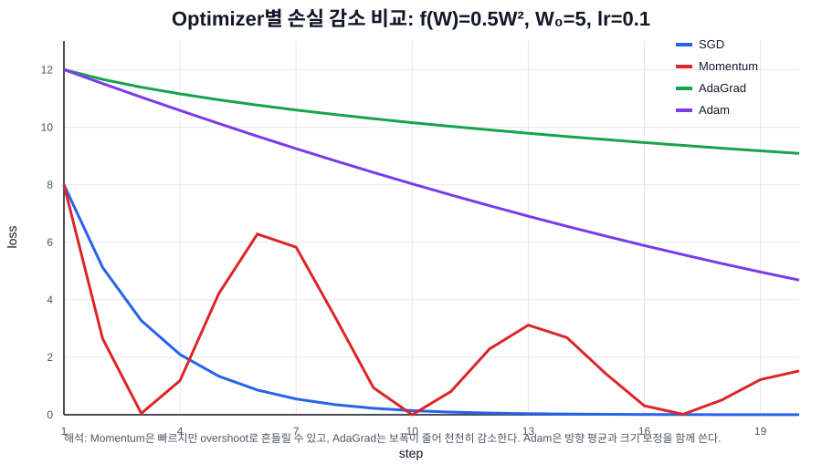

# Optimizer 정리: Momentum, AdaGrad, Adam

## 시각 자료

아래 그래프는 같은 함수에서 optimizer별로 손실이 어떻게 줄어드는지 비교한 예시이다.

예시 조건:

```text
목적 함수: f(W) = 0.5 * W^2
시작점: W = 5
learning rate: 0.1
step: 20
```



이 그래프는 “항상 이 optimizer가 더 좋다”를 말하는 그림이 아니다. 같은 예시에서도 optimizer마다 움직임의 성격이 다르다는 것을 보기 위한 그림이다.

```text
SGD:
현재 gradient만 보고 안정적으로 내려간다.

Momentum:
이전 이동량이 붙어서 빠르게 내려가지만, lr이 크면 최솟값을 지나쳐 흔들릴 수 있다.

AdaGrad:
gradient 제곱을 누적하므로 시간이 갈수록 보폭이 줄어든다.

Adam:
방향 평균(m)과 크기 보정(v)을 함께 사용한다.
```

## 1. Optimizer가 하는 일

신경망 학습에서는 손실 함수 `L`을 줄이기 위해 파라미터 `W`를 조금씩 바꾼다.

가장 기본 형태는 다음과 같다.

```text
W = W - lr * grad
```

여기서:

```text
W: 학습할 파라미터
grad: dL/dW, W에 대한 손실의 기울기
lr: learning rate, 한 번에 얼마나 움직일지 정하는 값
```

이 기본 방식이 SGD이다.

```text
SGD:
W = W - lr * grad
```

Momentum, AdaGrad, Adam은 모두 이 업데이트를 더 잘하기 위한 방법이다.

## 2. 코드에서 `params`와 `grads`가 뜻하는 것

Optimizer의 `update(params, grads)`는 보통 다음 두 딕셔너리를 받는다.

```python
params = {
    "W1": np.array(...),
    "b1": np.array(...),
    "W2": np.array(...),
    "b2": np.array(...),
}
```

```python
grads = {
    "W1": np.array(...),
    "b1": np.array(...),
    "W2": np.array(...),
    "b2": np.array(...),
}
```

`params`는 실제 학습 대상이다.

```text
params["W1"]: 1번째 Affine layer의 가중치
params["b1"]: 1번째 Affine layer의 편향
params["W2"]: 2번째 Affine layer의 가중치
params["b2"]: 2번째 Affine layer의 편향
```

`grads`는 각 파라미터에 대한 손실의 기울기이다.

```text
grads["W1"]: dL/dW1
grads["b1"]: dL/db1
grads["W2"]: dL/dW2
grads["b2"]: dL/db2
```

중요한 점은 `params`와 `grads`가 같은 key를 가진다는 것이다.

```text
params["W1"]와 grads["W1"]는 같은 파라미터 W1에 대한 값이다.
```

예를 들어:

```python
params["W"] = np.array([
    [1.0, 2.0],
    [3.0, 4.0],
])
```

```python
grads["W"] = np.array([
    [0.1, 0.2],
    [0.3, 0.4],
])
```

SGD라면 다음처럼 각 원소가 같은 위치끼리 업데이트된다.

```text
params["W"][0, 0] = 1.0 - lr * 0.1
params["W"][0, 1] = 2.0 - lr * 0.2
params["W"][1, 0] = 3.0 - lr * 0.3
params["W"][1, 1] = 4.0 - lr * 0.4
```

즉 optimizer는 하나의 숫자만 업데이트하는 것이 아니라, 배열 안의 모든 원소를 동시에 업데이트한다.

## 3. Adam에서 `m`과 `v`가 왜 `params`와 같은 구조를 갖는가

Adam은 각 파라미터마다 `m`과 `v`를 따로 기억해야 한다.

그래서 `self.m`, `self.v`도 `params`와 같은 key를 가진 딕셔너리로 둔다.

```python
self.m = {
    "W1": np.zeros_like(params["W1"]),
    "b1": np.zeros_like(params["b1"]),
}
```

```python
self.v = {
    "W1": np.zeros_like(params["W1"]),
    "b1": np.zeros_like(params["b1"]),
}
```

예를 들어 `params["W1"].shape`가 `(784, 512)`라면:

```text
params["W1"].shape = (784, 512)
grads["W1"].shape  = (784, 512)
self.m["W1"].shape = (784, 512)
self.v["W1"].shape = (784, 512)
```

왜 같은 shape여야 할까?

각 가중치 원소마다 gradient가 다르기 때문이다.

```text
W1[0, 0]의 gradient
W1[0, 1]의 gradient
W1[100, 20]의 gradient
```

이 값들이 모두 다르므로, Adam은 각 원소마다 따로:

```text
m: gradient 이동평균
v: gradient 제곱 이동평균
```

을 저장한다.

따라서 `m`, `v`는 스칼라 하나가 아니라 `params[key]`와 같은 shape의 배열이어야 한다.

## 4. `params[key]`, `grads[key]`, `m[key]`, `v[key]`의 관계

하나의 key `"W"`만 놓고 보면 Adam은 다음 값을 함께 사용한다.

```text
params["W"]: 현재 가중치 W
grads["W"]: 현재 W에 대한 gradient
m["W"]: W gradient의 이동평균
v["W"]: W gradient 제곱의 이동평균
```

업데이트 흐름은 다음과 같다.

```text
1. grads["W"]로 현재 gradient를 받는다.
2. m["W"]에 gradient의 이동평균을 저장한다.
3. v["W"]에 gradient 제곱의 이동평균을 저장한다.
4. m["W"]와 v["W"]를 조합해서 params["W"]를 업데이트한다.
```

식으로 쓰면:

```text
m["W"] = beta1 * m["W"] + (1 - beta1) * grads["W"]
```

```text
v["W"] = beta2 * v["W"] + (1 - beta2) * grads["W"]^2
```

```text
params["W"] = params["W"] - lr * m_hat / (sqrt(v_hat) + eps)
```

여기서 `m_hat`과 `v_hat`은 bias correction을 거친 값이다.

직관적으로:

```text
m["W"]: 어느 방향으로 움직일지
v["W"]: 얼마나 크게/작게 움직일지 조절하는 값
params["W"]: 실제로 바뀌는 대상
```

## 5. Momentum

Momentum은 “이전 이동 방향”을 기억한다.

기본 SGD는 매 step마다 현재 gradient만 보고 움직인다.

```text
W = W - lr * grad
```

Momentum은 여기에 이전 이동량을 섞는다.

```text
velocity = momentum * velocity - lr * grad
W = W + velocity
```

보통 `momentum` 값은 `0.9`를 많이 쓴다.

```text
momentum = 0.9
```

## 6. Momentum의 직관

공이 경사면을 굴러 내려간다고 생각하면 된다.

SGD는 매 순간 현재 기울기만 보고 움직인다.

```text
현재 기울기만 보고 한 걸음 이동
```

Momentum은 이전에 움직이던 방향도 기억한다.

```text
이전에도 오른쪽으로 가고 있었고
이번 gradient도 오른쪽 이동을 가리키면
더 강하게 오른쪽으로 이동
```

반대로 gradient가 자주 왔다 갔다 하면, 이전 이동량이 완충 역할을 한다.

## 7. Momentum 예시

초기값:

```text
W = 1.0
velocity = 0
lr = 0.1
momentum = 0.9
grad = 0.3
```

첫 번째 업데이트:

```text
velocity = 0.9 * 0 - 0.1 * 0.3
         = -0.03
```

```text
W = 1.0 + (-0.03)
  = 0.97
```

두 번째 업데이트에서 다시 `grad = 0.3`이라고 하자.

```text
velocity = 0.9 * (-0.03) - 0.1 * 0.3
         = -0.027 - 0.03
         = -0.057
```

```text
W = 0.97 + (-0.057)
  = 0.913
```

이전 이동량이 누적되어 더 크게 움직인다.

## 8. AdaGrad

AdaGrad는 “각 파라미터마다 학습률을 다르게 조절”한다.

기본 아이디어는 gradient 제곱을 계속 누적하는 것이다.

```text
h = h + grad^2
W = W - lr * grad / (sqrt(h) + eps)
```

여기서:

```text
h: 과거 gradient 제곱의 누적합
eps: 0으로 나누는 것을 막기 위한 작은 값
```

## 9. AdaGrad의 직관

어떤 파라미터의 gradient가 계속 크면 `h`가 커진다.

```text
h가 커짐
sqrt(h)가 커짐
lr * grad / sqrt(h)가 작아짐
```

즉 많이 움직였던 파라미터는 점점 조심스럽게 움직인다.

반대로 gradient가 작거나 드물게 나오는 파라미터는 `h`가 작아서 비교적 크게 움직일 수 있다.

## 10. AdaGrad 예시

초기값:

```text
W = 1.0
h = 0
lr = 0.1
grad = 0.3
eps = 1e-7
```

첫 번째 업데이트:

```text
h = 0 + 0.3^2
  = 0.09
```

```text
W = 1.0 - 0.1 * 0.3 / sqrt(0.09)
  = 1.0 - 0.03 / 0.3
  = 0.9
```

두 번째 업데이트에서 다시 `grad = 0.3`이라고 하자.

```text
h = 0.09 + 0.3^2
  = 0.18
```

```text
W = 0.9 - 0.1 * 0.3 / sqrt(0.18)
  = 0.9 - 0.03 / 0.424...
  = 약 0.829
```

처음보다 업데이트 폭이 줄었다.

## 11. AdaGrad의 한계

AdaGrad는 `h`를 계속 누적한다.

```text
h = h + grad^2
```

그러면 시간이 지날수록 `h`는 계속 커진다. `h`가 너무 커지면 업데이트 폭이 너무 작아질 수 있다.

```text
학습 후반에 거의 움직이지 못할 수 있음
```

이 문제를 완화하기 위해 RMSProp이나 Adam은 단순 누적 대신 이동평균을 사용한다.

## 12. Adam

Adam은 Momentum과 AdaGrad/RMSProp 계열 아이디어를 합친 optimizer이다.

Adam에서는 두 값을 저장한다.

```text
m: gradient의 이동평균
v: gradient 제곱의 이동평균
```

주의할 점:

```text
Momentum의 velocity v와 Adam의 v는 다르다.

Momentum의 v:
이전 이동량, velocity

Adam의 v:
gradient 제곱의 이동평균
```

Adam에서 Momentum 역할에 가까운 것은 `m`이다.

## 13. Adam 공식

Adam의 기본 공식은 다음과 같다.

```text
m = beta1 * m + (1 - beta1) * grad
v = beta2 * v + (1 - beta2) * grad^2
```

보통:

```text
beta1 = 0.9
beta2 = 0.999
```

여기서 `m`은 방향을 부드럽게 만든다.

```text
m: 어느 방향으로 갈지
```

`v`는 업데이트 크기를 조절한다.

```text
v: 얼마나 조심해서 갈지
```

최종 업데이트는:

```text
W = W - lr * m_hat / (sqrt(v_hat) + eps)
```

이다.

## 14. Bias correction

Adam에는 `bias correction`이라는 보정 단계가 있다.

처음에는 `m`과 `v`가 0에서 시작한다.

```text
m = 0
v = 0
```

그러면 초반의 `m`, `v`는 실제 평균보다 작게 잡히는 경향이 있다. 이를 보정하기 위해 다음을 사용한다.

```text
m_hat = m / (1 - beta1^t)
v_hat = v / (1 - beta2^t)
```

여기서:

```text
t: update가 몇 번째인지 나타내는 카운터
```

최종 업데이트는:

```text
W = W - lr * m_hat / (sqrt(v_hat) + eps)
```

## 15. Adam 예시

초기값:

```text
W = 1.0
m = 0
v = 0
lr = 0.001
beta1 = 0.9
beta2 = 0.999
grad = 0.3
t = 1
```

먼저 `m`:

```text
m = 0.9 * 0 + (1 - 0.9) * 0.3
  = 0.03
```

다음 `v`:

```text
v = 0.999 * 0 + (1 - 0.999) * 0.3^2
  = 0.001 * 0.09
  = 0.00009
```

보정:

```text
m_hat = 0.03 / (1 - 0.9^1)
      = 0.03 / 0.1
      = 0.3
```

```text
v_hat = 0.00009 / (1 - 0.999^1)
      = 0.00009 / 0.001
      = 0.09
```

업데이트:

```text
W = 1.0 - 0.001 * 0.3 / (sqrt(0.09) + eps)
  = 1.0 - 0.001 * 0.3 / 0.3
  = 0.999
```

## 16. Momentum, AdaGrad, Adam 비교

| Optimizer | 저장하는 값 | 핵심 아이디어 | 업데이트 특징 |
|---|---|---|---|
| SGD | 없음 | 현재 gradient만 사용 | 단순하지만 흔들릴 수 있음 |
| Momentum | velocity | 이전 이동 방향 기억 | 같은 방향이면 더 빠르게 이동 |
| AdaGrad | h | gradient 제곱 누적 | 많이 움직인 파라미터의 보폭 감소 |
| Adam | m, v | Momentum + 제곱 gradient 이동평균 | 방향과 보폭을 함께 조절 |

## 17. 변수 이름 정리

Momentum에서:

```text
v = velocity
```

의미:

```text
이전 이동량
```

AdaGrad에서:

```text
h = gradient 제곱 누적합
```

의미:

```text
각 파라미터가 지금까지 얼마나 큰 gradient를 받았는지
```

Adam에서:

```text
m = gradient 이동평균
v = gradient 제곱 이동평균
```

의미:

```text
m: Momentum 계열, 방향 기억
v: AdaGrad/RMSProp 계열, 크기 보정
```

## 18. 코드 관점에서 Adam 구현 순서

Adam 구현은 보통 다음 순서로 진행한다.

```text
1. t를 1 증가시킨다.
2. 각 파라미터 key에 대해 m, v가 없으면 0 배열로 초기화한다.
3. m에 gradient 이동평균을 저장한다.
4. v에 gradient 제곱 이동평균을 저장한다.
5. m_hat, v_hat으로 bias correction을 한다.
6. params[key]를 업데이트한다.
```

식으로 쓰면:

```text
t = t + 1
```

```text
m[key] = beta1 * m[key] + (1 - beta1) * grads[key]
```

```text
v[key] = beta2 * v[key] + (1 - beta2) * grads[key]^2
```

```text
m_hat = m[key] / (1 - beta1^t)
```

```text
v_hat = v[key] / (1 - beta2^t)
```

```text
params[key] = params[key] - lr * m_hat / (sqrt(v_hat) + eps)
```

## 19. 핵심 정리

SGD:

```text
현재 gradient만 보고 이동한다.
```

Momentum:

```text
이전 이동 방향을 기억한다.
```

AdaGrad:

```text
gradient 제곱을 누적해서 파라미터별 보폭을 줄인다.
```

Adam:

```text
gradient 이동평균으로 방향을 잡고,
gradient 제곱 이동평균으로 보폭을 조절한다.
```

가장 헷갈리는 부분:

```text
Adam의 v는 Momentum의 velocity가 아니다.
Adam의 m이 Momentum 역할에 가깝다.
Adam의 v는 AdaGrad의 h 역할에 가깝다.
```
